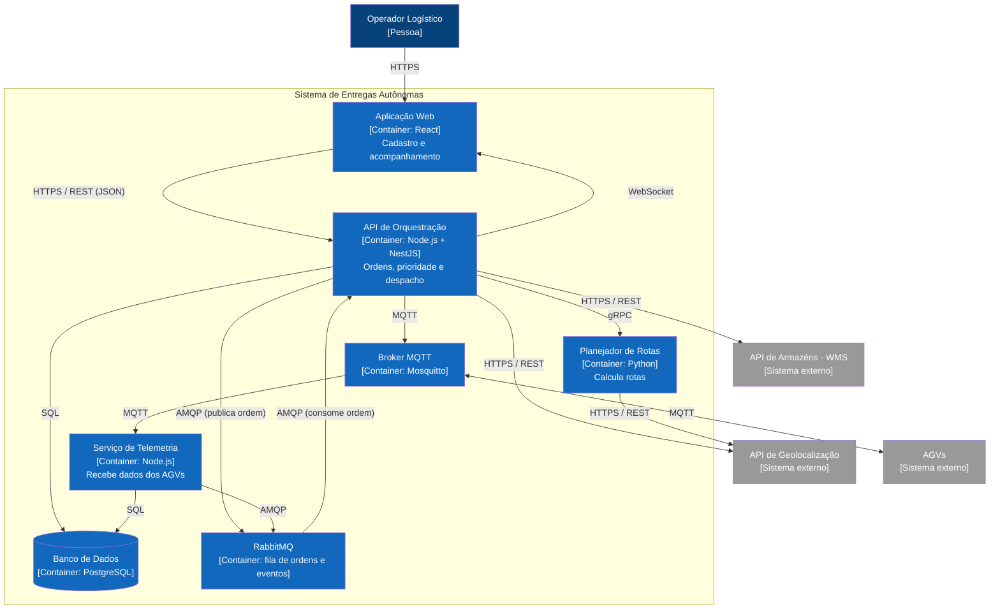

# C4 Nível 2 - Containers do sistema

```mermaid
flowchart TB
    op["Operador Logístico<br/>[Pessoa]"]

    subgraph sistema[Sistema de Entregas Autônomas]
        web["Aplicação Web<br/>[Container: React]<br/>Cadastro e acompanhamento"]
        api["API de Orquestração<br/>[Container: Node.js + NestJS]<br/>Ordens, prioridade e despacho"]
        planejador["Planejador de Rotas<br/>[Container: Python]<br/>Calcula rotas"]
        tel["Serviço de Telemetria<br/>[Container: Node.js]<br/>Recebe dados dos AGVs"]
        bd[("Banco de Dados<br/>[Container: PostgreSQL]")]
        fila["RabbitMQ<br/>[Container: fila de ordens e eventos]"]
        broker["Broker MQTT<br/>[Container: Mosquitto]"]
    end

    geo["API de Geolocalização<br/>[Sistema externo]"]
    wms["API de Armazéns - WMS<br/>[Sistema externo]"]
    agv["AGVs<br/>[Sistema externo]"]

    op -->|HTTPS| web
    web -->|"HTTPS / REST (JSON)"| api
    api -->|WebSocket| web
    api -->|SQL| bd
    api -->|"HTTPS / REST"| geo
    api -->|"HTTPS / REST"| wms
    api -->|"AMQP (publica ordem)"| fila
    fila -->|"AMQP (consome ordem)"| api
    api -->|gRPC| planejador
    planejador -->|"HTTPS / REST"| geo
    api -->|MQTT| broker
    broker <-->|MQTT| agv
    broker -->|MQTT| tel
    tel -->|SQL| bd
    tel -->|AMQP| fila

    classDef pessoa fill:#08427b,color:#fff
    classDef container fill:#1168bd,color:#fff
    classDef ext fill:#999,color:#fff
    class op pessoa
    class web,api,planejador,tel,bd,fila,broker container
    class geo,wms,agv ext
```
