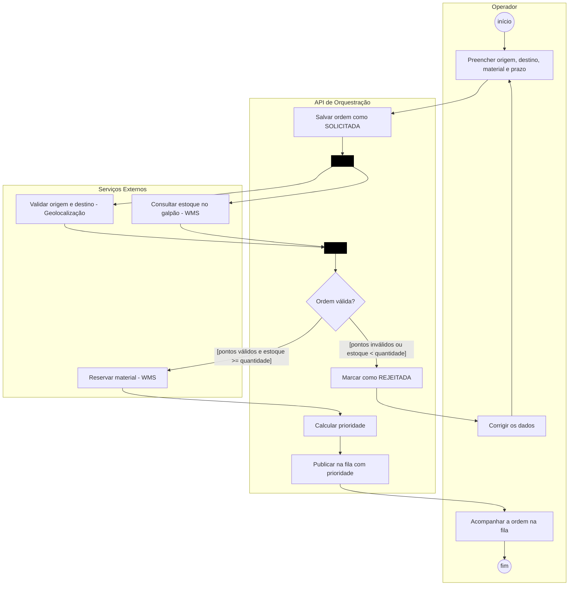

# Diagrama de Atividades - Cadastro e Priorização da Ordem

```mermaid
flowchart TB
    subgraph R1[Operador]
        I((início))
        A1[Preencher origem, destino, material e prazo]
        A2[Corrigir os dados]
        A3[Acompanhar a ordem na fila]
        F((fim))
    end

    subgraph R2[API de Orquestração]
        B1[Salvar ordem como SOLICITADA]
        FORK[ ]:::barra
        JOIN[ ]:::barra
        D1{Ordem válida?}
        B2[Marcar como REJEITADA]
        B3[Calcular prioridade]
        B4[Publicar na fila com prioridade]
    end

    subgraph R3[Serviços Externos]
        C1[Validar origem e destino - Geolocalização]
        C2[Consultar estoque no galpão - WMS]
        C3[Reservar material - WMS]
    end

    I --> A1 --> B1 --> FORK
    FORK --> C1 --> JOIN
    FORK --> C2 --> JOIN
    JOIN --> D1
    D1 -->|"[pontos inválidos ou estoque < quantidade]"| B2 --> A2 --> A1
    D1 -->|"[pontos válidos e estoque >= quantidade]"| C3 --> B3 --> B4 --> A3 --> F

    classDef barra fill:#000,stroke:#000,color:#000
```
