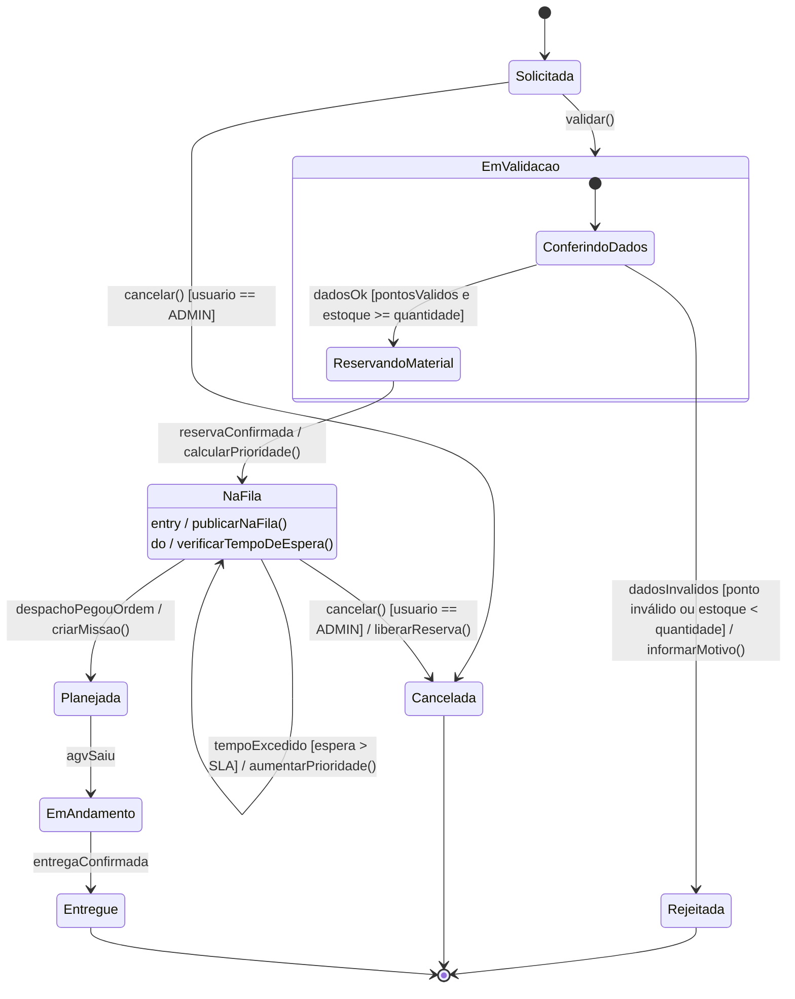

# Diagrama de Estados - OrdemEntrega

```mermaid
stateDiagram-v2
    [*] --> Solicitada

    Solicitada --> EmValidacao : validar()
    Solicitada --> Cancelada : cancelar() [usuario == ADMIN]

    state EmValidacao {
        [*] --> ConferindoDados
        ConferindoDados --> ReservandoMaterial : dadosOk [pontosValidos e estoque >= quantidade]
    }

    ConferindoDados --> Rejeitada : dadosInvalidos [ponto inválido ou estoque < quantidade] / informarMotivo()
    ReservandoMaterial --> NaFila : reservaConfirmada / calcularPrioridade()

    state "NaFila" as NaFila
    NaFila : entry / publicarNaFila()
    NaFila : do / verificarTempoDeEspera()

    NaFila --> NaFila : tempoExcedido [espera > SLA] / aumentarPrioridade()
    NaFila --> Planejada : despachoPegouOrdem / criarMissao()
    NaFila --> Cancelada : cancelar() [usuario == ADMIN] / liberarReserva()

    Planejada --> EmAndamento : agvSaiu
    EmAndamento --> Entregue : entregaConfirmada

    Rejeitada --> [*]
    Cancelada --> [*]
    Entregue --> [*]
```
