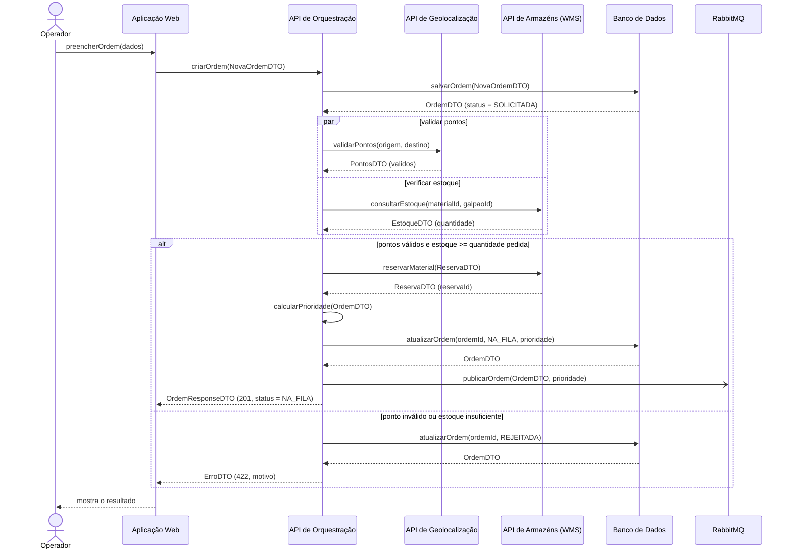

# Diagrama de Sequência - Cadastro de Ordem de Entrega

```mermaid
sequenceDiagram
    actor Operador
    participant Web as Aplicação Web
    participant API as API de Orquestração
    participant Geo as API de Geolocalização
    participant WMS as API de Armazéns (WMS)
    participant BD as Banco de Dados
    participant Fila as RabbitMQ

    Operador->>Web: preencherOrdem(dados)
    Web->>API: criarOrdem(NovaOrdemDTO)
    API->>BD: salvarOrdem(NovaOrdemDTO)
    BD-->>API: OrdemDTO (status = SOLICITADA)

    par validar pontos
        API->>Geo: validarPontos(origem, destino)
        Geo-->>API: PontosDTO (validos)
    and verificar estoque
        API->>WMS: consultarEstoque(materialId, galpaoId)
        WMS-->>API: EstoqueDTO (quantidade)
    end

    alt pontos válidos e estoque >= quantidade pedida
        API->>WMS: reservarMaterial(ReservaDTO)
        WMS-->>API: ReservaDTO (reservaId)
        API->>API: calcularPrioridade(OrdemDTO)
        API->>BD: atualizarOrdem(ordemId, NA_FILA, prioridade)
        BD-->>API: OrdemDTO
        API-)Fila: publicarOrdem(OrdemDTO, prioridade)
        API-->>Web: OrdemResponseDTO (201, status = NA_FILA)
    else ponto inválido ou estoque insuficiente
        API->>BD: atualizarOrdem(ordemId, REJEITADA)
        BD-->>API: OrdemDTO
        API-->>Web: ErroDTO (422, motivo)
    end

    Web-->>Operador: mostra o resultado
```
